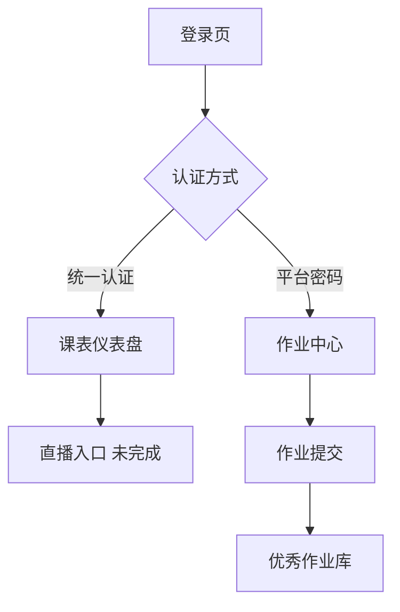

# 北交大课程平台优化版


[](https://vuejs.org/)
[](https://www.typescriptlang.org/)

> 基于官方接口重构的现代化课程平台 二次开发 性能与体验全面升级 支持多端适配 功能聚合 

**点击访问:** [课程平台魔改版 (57d02.cn)](http://hw.57d02.cn:8080/)

注：部署在BJTU主校区10.60网段内，需要10.61网段ip才能够访问（连接：phone.wlan.bjtu）

## 🌟 项目亮点

### 核心功能增强

- 🐞 **历史问题修复**：解决原平台作业批改后分数/评语不显示的问题
- 🚀 **创新功能扩展**：
  - **成绩排名系统** (妈妈再也不怕我卷不起来了😤)
  - **优秀作业参考** （自动取出前五的作业，方便大家学习、对比、找差距🤔）
  - **偷看作业**（实在没思路怎么办？看看交了的同学这么做的😝）
- 📱 **全端适配**：支持PC/平板/手机等移动设备（美不美观不重要，比原平台好用点，至少比例对了🤗）
- 🧩 **功能聚合**：
  - 作业管理（查看/提交/批改）
  - 实时课表（当日剩余视图）
  - 课程直播集成（看看老师点没点名）
  - 统一身份认证（目前只用于登入认证，懒得做其他的）

### 🚄 性能优化
- ⚡ **网络请求优化**：并发请求池（太高并发别把学校服务器搞炸了😐）
  
- **⚡ 异步任务优化**：异步任务队列（信息请求的先后顺序别搞错）
  
- 🖥️ **渲染优化**：
  - 骨架屏懒加载，减少大量DOM渲染负担。
  - 动态模块懒加载
  - 接口响应缓存
  
- 🔗 **多源接口聚合**：
  
  通过nginx代理实现跨域接口调用
  
| 接口来源    | 开发方式       | 功能模块      |
| ----------- | -------------- | ------------- |
| 原课程平台  | F12网络分析    | 作业/成绩相关 |
| 轻新课堂APP | 小蓝鸟抓包逆向 | 实时课表/直播 |
| CAS认证系统 | F12网络分析    | 统一身份认证  |

  ```mermaid
  graph LR
    A[网页端接口] -->|Nginx代理| C
    B[轻新课堂APP接口] -->|Nginx代理| C
    D[CAS认证接口] -->|Nginx代理| C
    C[前端服务] --> E{用户终端}
  ```

### 🔒 安全体系

- 🔐 **数据加密**：
  - AES-256-CBC加密存储用户凭证
- 🛡️ **会话保护**：
  - 会话自动重连机制

## 🚀 部署方式

由于本人家境贫寒，没有服务器可租用，因此临时爆改妈妈的旧手机（HUAWEI 畅想10），使用nginx反向代理到8080端口，挂载到了校园局域网。

注意：上传的项目中屏蔽了平台接口的login调用方式，因为原平台漏洞允许无密码登入任意账号


## 📖 使用指南

### 关键功能路径


### 常见问题处理
- 🔄 **服务重连机制**：
  1. 打开侧边栏，自动进行服务状态检查
  4. 持续重连失败需重新登录
  
- 🔑 **密码同步问题**：
  
  使用统一认证登入时无法调用app接口，解决方案（任选其一）：
  
  1. 课程平台的密码与认证密码同步(侧边栏提供操作接口)
  2. 使用课程平台账号密码登入


## 📜 开源协议
本项目采用 [MIT License](LICENSE)，请遵守以下条款：
- 禁止将本项目用于商业用途
- 引用代码需保留原始版权声明
- 不得恶意攻击官方服务器

> 💡 本系统为教学研究项目，开发者不对滥用行为负责