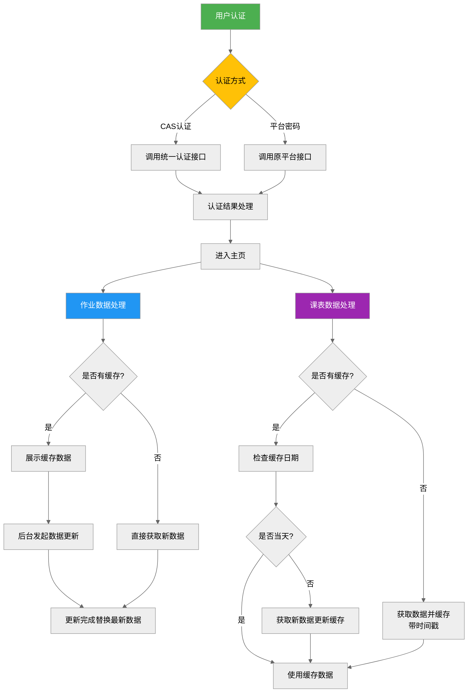

# 北交大课程平台优化版

[](https://vuejs.org/)
[](https://www.typescriptlang.org/)
> 基于官方接口重构的现代化课程平台 二次开发 性能与体验全面升级 支持多端适配 功能聚合 

**点击访问:** [课程平台魔改版 (57d02.cn)](http://hw.57d02.cn:8080/)
注：部署在BJTU主校区10.60网段内，需要10.61网段ip才能够访问
（人话：请连接连接 phone.wlan.bjtu）
## 🌟核心功能增强
- 🐞 **历史问题修复**：解决原平台作业批改后分数/评语不显示的问题
- 🚀 **创新功能扩展**：
  - **会话保持**：(我真的不想输密码)
    - AES-256-CBC加密存储用户凭证
    - 会话自动重连机制
  - **基础功能增强**：
    - 继承作业查看，预览和提交功能，新增多文件一起上传。（再也不想一个个点了）
    - 新增删除已提交作业功能（人机兄弟交错作业后发现不能重复提交，顺手新增这个功能）
> 至于过期补交功能，个人认为无这个必要。后端已经禁止到期后的公开作业关联个人提交的作业，如果非要实现只能延长作业截止时间（其他人的也会延长），虽然能做，但不妥。不过后端依然允许过期覆盖，同时也有接口能实现不覆盖的情况下修改作业（即修改已批改的作业也不会影响成绩），因此强烈建议到期之前先点提交，后续找补。
  - **待办列表**:
    - 方便的查看和提交待完成的任务
      - 截止倒计时(感受到紧迫感了吗)
  - **成绩排名**
    - 老师批改后，根据分数排位 (妈妈再也不怕我卷不起来了😤)
  - **作业参考**：
    -  自动取出前五的作业，方便大家学习、对比、找差距🤔
     - 偷看作业（看看谁是第一个交作业的🤓实在没思路怎么办？看看交了的同学这么做的😝 
   - **每日课表**
     -  剩余课程上课下课倒计时
     - 课程直播集成（看看老师点没点名😢）
   - **统一身份认证**：省得你先登mis再跳过来。
   - 📱 **全端适配**：
     - 支持PC/平板/手机移动设备（普通设备比例应该没问题）
     -  autoprefixer补全各内核浏览器的CSS前缀
   - **界面美化**：使用统一圆角，不失优雅。
## 🚄 性能优化
因为推荐高频率打开网站看看，而且移动端设备普遍性能偏低，因此网站做了许多性能优化工作。
- ⚡ **网络请求优化**：并发请求池（限制3并发请求，太高并发别把学校服务器搞炸了😐）
  
- **⚡ 异步任务优化**：异步任务队列，实现有序懒加载，用于延迟网络请求，均衡时间上负载。
  
- 🖥️ **渲染优化**：
  - 骨架屏延迟复杂DOM渲染，避免动画和网络请求资源竞争。
  	
  
- **缓存优化**：
  - 优先展示缓存的数据，后台异步更新数据。因此只有初次登入等待时间偏长。
    - 时间戳缓存当日课表，一日一更。
> 注意：每次打开都会尝试更新数据，但由于是懒更新，因此会先展示缓存的数据，出现“数据更新完成”提示后才是最新的数据。
  
- 🔗 **多源接口聚合**：
  通过nginx代理实现跨域接口调用
| 接口来源    | 开发方式       | 功能模块      |
| ----------- | -------------- | ------------- |
| 原课程平台  | F12网络分析    | 作业/成绩相关 |
| 轻新课堂APP | 小蓝鸟抓包逆向 | 实时课表/直播 |
| CAS认证系统 | F12网络分析    | 统一身份认证  |

  ```mermaid
  graph LR
    C -->|Nginx代理| A[网页端接口]
    C -->|Nginx代理| B[轻新课堂APP接口]
    C -->|Nginx代理| D[CAS认证接口]
    E{用户终端} --> C[前端服务]
  ```
## 🚀 部署
　　由于本人家境贫寒，没有服务器可用，因此临时利用妈妈的旧手机（HUAWEI 畅想10），使用nginx反向代理到校园局域网。
注意：为避免接口滥用，上传的项目中屏蔽了平台接口的调用方式。（想要自己抓去）
### 验证与缓存路径

### 常见问题处理
- 🔄 **服务状态检查**：
  1. 打开侧边栏，自动进行服务状态检查
  2. 持续重连失败需手动退出重新登录
  
- 🔑 **密码同步问题**：
  使用统一认证登入时无法调用app接口，解决方案（任选其一）：
  
  1. 课程平台的密码与认证密码同步(侧边栏提供操作接口)
  2. 使用课程平台账号密码登入

## 📜 开源协议
本项目采用 [MIT License](LICENSE)，请遵守以下条款：
- 禁止将本项目用于商业用途
- 引用代码需保留原始版权声明
- 不得恶意攻击官方服务器
> 💡 本系统为教学研究项目，开发者不对滥用行为负责