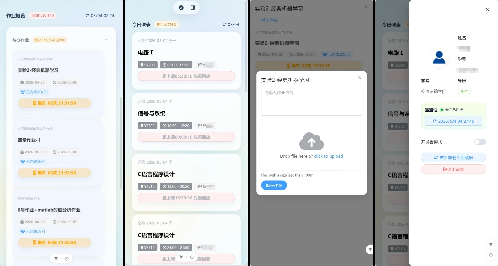
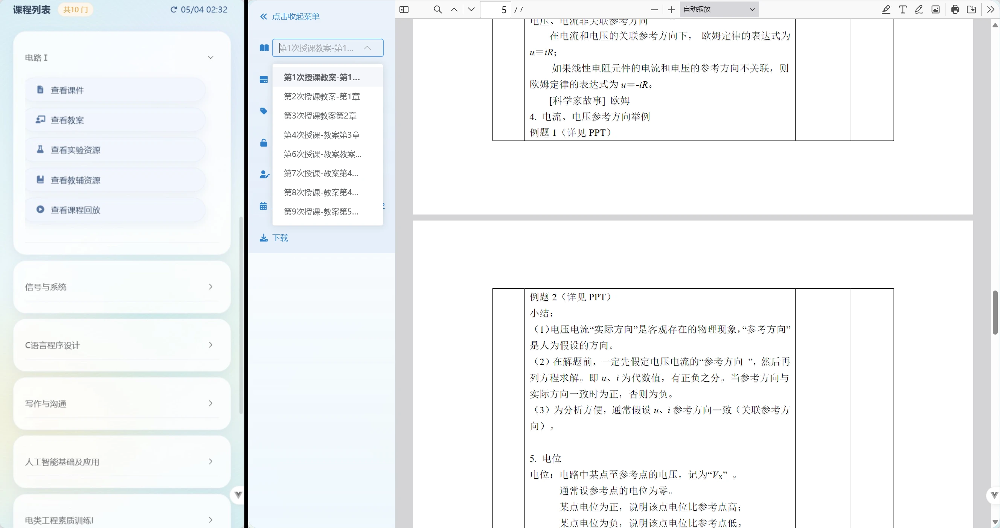
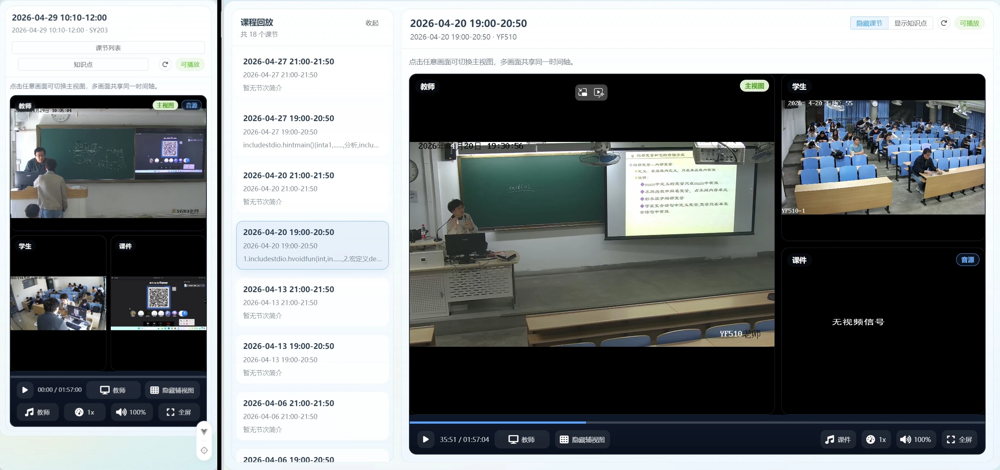

# 北交大课程平台青春版

一个基于官方接口重构的课程平台，适配移动设备和常用功能集中放置。

## 🌟核心功能介绍

#### 移动端UI+功能聚合
手机保存本站，随手打开查看，今日剩余课表、待交作业一目了然。
- 集合所有科目待完成的作业，快捷查看和提交。
- 截止倒计时(感受到紧迫感了吗)
- 通过课程分类查看作业

#### 自动登入和会话保持
网页本地存储账号信息，打开网站自动登入，节约先开mis再跳转浪费的时间。会话过期可以快速刷新。

#### 资源浏览功能增强
原平台每次只能预览一个课件，切换课件很麻烦，因此有了这个功能。同时集中放置了教案等资源入口
- 快捷切换浏览资源
- 提供pdfjs高版本特性，如大纲、高亮画笔、文字搜索、全屏放映等功能

#### 提交作业功能增强
原先交作业提交多个附件时，得一个个点，因此:
- 继承作业查看，预览和提交功能，增强：新增拖动上传，多文件一起上传

- 覆盖提交功能(如果老师允许的话)

- 过期补交功能。(如果老师允许的话)

#### 课程回放

原平台做的视频回放很原始，而且手机端都不知道怎么看。

**国内访问:**（建议ipv6访问）
[course.bjtu.top](https://course.bjtu.top/)

>感谢好朋友 上条当咩 提供的子域名、证书和服务器。

## 📜 开源协议
本项目采用 [MIT License](LICENSE)，请遵守以下条款：
- 禁止将本项目用于商业用途
- 引用代码需保留原始版权声明
- 不得恶意攻击官方服务器
> 💡 本系统为教学研究项目，开发者不对滥用行为负责

